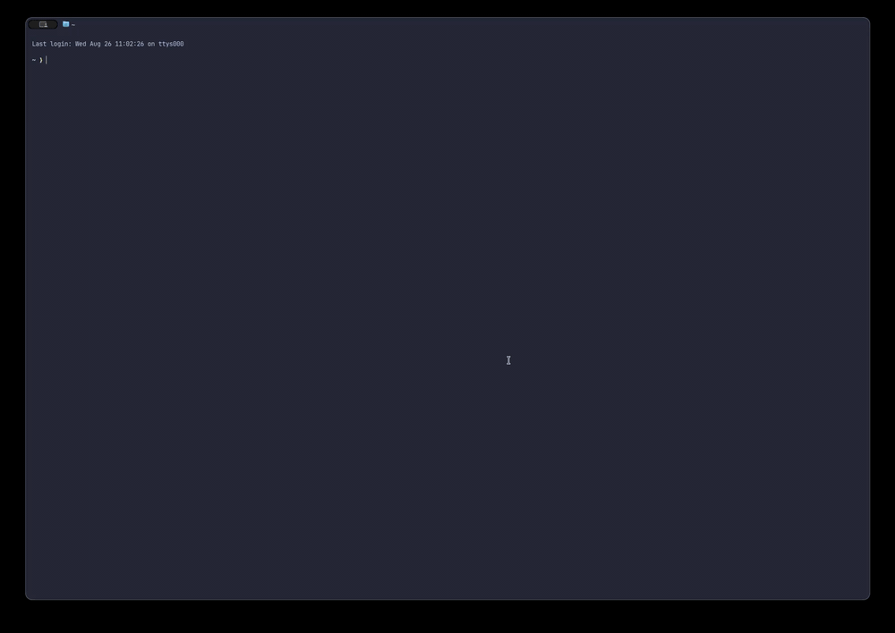

# rtop

A beautiful terminal system monitor in the style of `top` and `bpytop`, written in
Rust with [ratatui] + [crossterm]. It renders a live dashboard of CPU, memory,
GPU, network, disk, battery & sensors, and a sortable process table — themed with
a built-in set of [Catppuccin], Dracula, Nord, and GitHub palettes.

[ratatui]: https://ratatui.rs
[crossterm]: https://github.com/crossterm-rs/crossterm

## Demo



## Features

- Live CPU (global + per-core), memory & swap, GPU, network I/O rates (with
  private/WAN IP in the header), and disk usage
- Battery status (with cycle count and health), temperature sensors, and fan
  speeds (where available)
- Sortable, filterable process table with selection, mouse support, per-process
  details popup (with command line, CPU/memory history graphs), and process kill
- Seven built-in themes (Catppuccin ×4, Dracula, Nord, GitHub Dark) with runtime
  cycling and optional transparent background
- Sparkline history for CPU, GPU, and network; per-core CPU load, model, and load average
- Block-bar usage chart for memory; disk usage table (colored by fullness)
- In-app settings menu to change refresh rate, theme, transparency, and WAN IP
  live
- Config file for theme and refresh interval, overridable via CLI flags
- Non-blocking data collection on a background thread — a slow sensor never janks the UI

## Install

### From source

```sh
cargo install --path .
```

### Prebuilt binaries (macOS)

Prebuilt binaries for Apple Silicon (`aarch64-apple-darwin`) and Intel
(`x86_64-apple-darwin`) are attached to each [GitHub release]. Download the
tarball for your architecture, extract it, and put `rtop` on your `PATH`:

```sh
tar -xzf rtop-v0.6.0-aarch64-apple-darwin.tar.gz
sudo mv rtop /usr/local/bin/
```

The binaries are unsigned, so macOS Gatekeeper may quarantine them on first
launch. If you see a "cannot be opened" warning, clear the quarantine flag:

```sh
xattr -d com.apple.quarantine /usr/local/bin/rtop
```

[GitHub release]: https://github.com/mojoaar/rtop/releases

## Usage

Run from the repository:

```sh
cargo run
```

Or, once installed:

```sh
rtop
```

CLI flags override config values:

```sh
rtop --theme macchiato --interval 500
```

| Flag          | Description                                    |
| ------------- | ---------------------------------------------- |
| `--theme`     | Theme: `latte`, `frappe`, `macchiato`, `mocha`, `dracula`, `nord`, `github-dark` |
| `--interval`  | Refresh interval in milliseconds               |

## Keybindings

| Key             | Action                                  |
| --------------- | --------------------------------------- |
| `q`             | Quit                                    |
| `t`             | Cycle theme                             |
| `c` / `m` / `p` / `n` | Sort processes by CPU / memory / PID / name |
| `↑` / `↓`       | Move process selection                  |
| `k`             | Open the signal menu (Term / Kill / Interrupt) |
| `f`             | Filter processes by name, user, or PID  |
| `i`             | Show per-interface network rates        |
| `space`         | Pause / resume live updates             |
| `s`             | Open the settings menu                  |
| `z`             | Toggle full-screen process view         |
| `Enter`         | Show details for the selected process   |
| `?`             | Show the help popup                     |
| `Esc`           | Close popup / cancel filter             |
| Mouse click     | Select the process under the cursor     |
| Mouse scroll    | Move process selection                  |

While filtering, type to match process names (case-insensitive), usernames, or
PIDs, `Enter` to apply, `Esc` to cancel, `Backspace` to delete.

The sort key and direction (set with `c`/`m`/`p`/`n`) persist across sessions
along with the theme and settings.

## Themes

`rtop` ships with seven built-in themes:

- `latte`, `frappe`, `macchiato`, `mocha` — Catppuccin
- `dracula` — Dracula
- `nord` — Nord
- `github-dark` — GitHub

Select one at startup with `--theme <name>`, or press `t` at any time to cycle
through them. The chosen theme is persisted to the config file. Note that the
light theme (`latte`) reads best with `transparent = false` or a light terminal.

## Settings menu

Press `s` to open the in-app settings menu. Use `↑`/`↓` to pick a row and
`←`/`→` to change its value; `Esc` closes it. Changes apply immediately and
are persisted to the config file:

| Setting     | Values                                            |
| ----------- | ------------------------------------------------- |
| Refresh     | `100`, `250`, `500`, `1000`, `2000`, `5000` ms    |
| Theme       | `latte`, `frappe`, `macchiato`, `mocha`, `dracula`, `nord`, `github-dark` |
| Transparent | `on` / `off` (terminal background vs theme bg)  |
| Time        | `on` / `off` (show the clock in the footer)       |
| Uptime      | `on` / `off` (show uptime in the footer)          |
| Labels      | `on` / `off` (show Active/History chart labels)   |
| Sort key    | `cpu`, `memory`, `pid`, `name`                    |
| Sort dir    | `asc` / `desc`                                    |
| WAN IP      | `on` / `off` (fetch public IP via the URL below)  |
| WAN URL     | endpoint returning your public IP (press `Enter` to edit) |

The active refresh rate is shown in the footer next to the clock and uptime.
When WAN IP is enabled, the Network panel header shows `private` and `wan`
addresses (fetched with `curl` from the configured URL).

## Config

Settings live in a TOML file at the platform config directory (via the `dirs` crate):

| Platform | Path                                        |
| -------- | ------------------------------------------- |
| macOS    | `~/Library/Application Support/rtop/config.toml` |
| Linux    | `~/.config/rtop/config.toml`                |
| Windows  | `%APPDATA%\rtop\config.toml`                |

Format:

```toml
[theme]
flavor = "mocha"        # latte | frappe | macchiato | mocha | dracula | nord | github-dark

[general]
interval_ms = 500       # sampling + render tick, in milliseconds
transparent = true      # use the terminal's background (false = theme bg)
show_time = true        # show the clock in the footer
show_uptime = true      # show system uptime in the footer
show_labels = true      # show Active/History chart labels
sort_key = "cpu"        # cpu | memory | pid | name
sort_dir = "desc"       # asc | desc
wan_enabled = false     # fetch and display the public (WAN) IP
wan_url = "https://echo.johansen.foo/api/ip"  # endpoint returning your public IP
```

The file is created automatically when you cycle themes (`t`).

## Platform support

| Feature                        | macOS | Linux | Windows |
| ------------------------------ | :---: | :---: | :-----: |
| CPU, memory & swap             |  ✓    |  ✓    |   ✓     |
| Network & disk I/O             |  ✓    |  ✓    |   ✓     |
| Processes (list/sort/kill)     |  ✓    |  ✓    |   ✓*    |
| Battery                        |  ✓    |  ✓    |   ✓     |
| Temperatures                   |  ✓    |  ✓*   |   ✓*    |
| GPU utilization & memory       |  ✓    |  ✓    |   —     |
| Fan speed                      |  ✓    |  ✓    |   —     |

`*` — provided by the cross-platform `sysinfo` backend; platform-specific
behavior may vary.

**macOS** is the reference platform and is fully supported, including GPU
(IOKit `PerformanceStatistics`) and fan speed (SMC via `smc-lib`).

**Linux** supports GPU metrics through NVIDIA NVML or the DRM sysfs interface
(AMD/Intel) and fan speed through hwmon. **Windows** supports CPU, memory,
network, disk, battery, temperatures, and processes through `sysinfo`, but GPU
and fan metrics are not yet implemented and render as `n/a`. Missing sensors
degrade gracefully rather than crashing.
